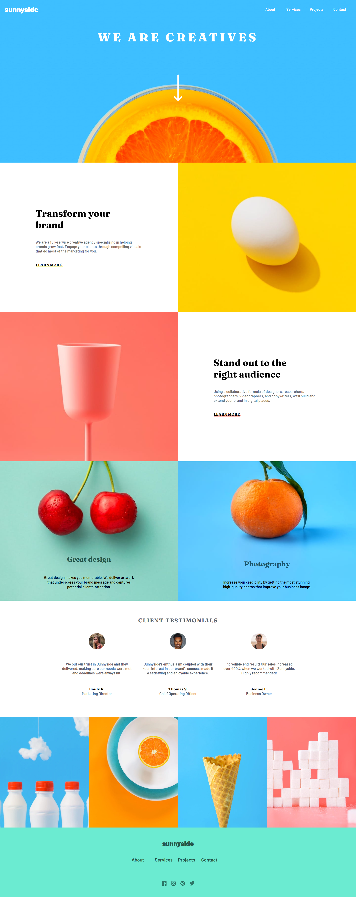

# Frontend Mentor - Sunnyside agency landing page solution

This is a solution to the [Sunnyside agency landing page challenge on Frontend Mentor](https://www.frontendmentor.io/challenges/sunnyside-agency-landing-page-7yVs3B6ef). Frontend Mentor challenges help you improve your coding skills by building realistic projects.

## Table of contents

- [Overview](#overview)
  - [Screenshot](#screenshot)
  - [Links](#links)
- [My process](#my-process)
  - [Built with](#built-with)
- [Author](#author)

**Note: Delete this note and update the table of contents based on what sections you keep.**

## Overview

### Screenshot

### Links

- Solution URL: [https://josephmadras.github.io/sunny-side-agency-landing-page/](https://josephmadras.github.io/sunny-side-agency-landing-page/)
- Live Site URL: [https://josephmadras.github.io/sunny-side-agency-landing-page/](https://josephmadras.github.io/sunny-side-agency-landing-page/)

## My process

### Built with

- HTML5
- CSS
- Flexbox
- Minimal JavaScript for the responsive menu

## Author

- Frontend Mentor - [@JosephKabemba](https://www.frontendmentor.io/profile/JosephKabemba)
